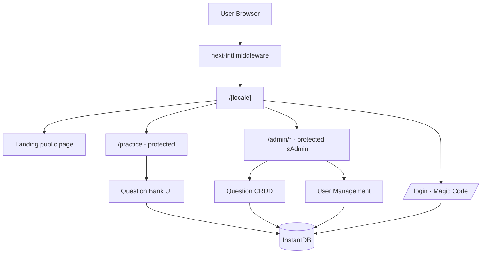
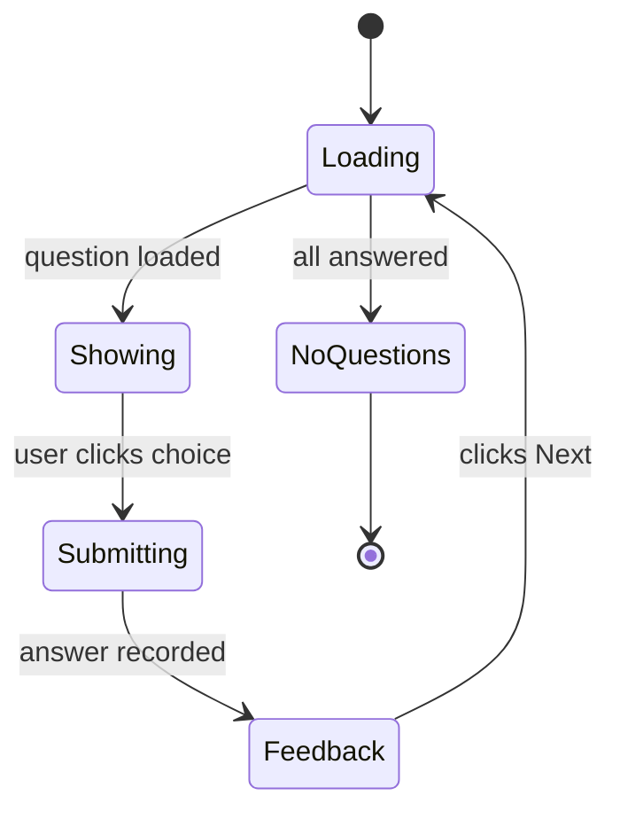

# MedQ MVP — Design Spec

**Date:** 2026-05-23
**Status:** Approved by user (brainstorming phase)
**Scope:** First releasable cut of MedQ — an interactive medical exam platform for Saudi medical students and physicians.

---

## 1. Goal

Ship the smallest possible experience that lets a medical student:

1. Sign in via email.
2. Solve one MCQ at a time from a curated Internal Medicine bank.
3. See immediate feedback (correct/incorrect + explanation).
4. Continue to the next unseen question until the bank is exhausted.

And lets an administrator:

1. Add, edit, delete, and publish/unpublish questions.
2. Enable or disable user accounts.

Everything beyond that is explicitly deferred (see §10).

## 2. Confirmed product decisions

| Decision | Choice | Rationale |
|----------|--------|-----------|
| Storage | InstantDB | Real-time, simple setup, matches existing MCP. |
| Auth | InstantDB Magic Codes (email + code) | Built-in, no password management. |
| Question content language | English only | Matches Saudi medical curriculum. UI remains bilingual ar/en. |
| Categorization | Free tags | Flexible, no enum maintenance. |
| Practice flow | One question + Next button | Aligns with user's explicit request. |
| Progress tracking | Yes (stored answers, immutable) | Required to support "next unseen question" and future stats. |
| Admin gating | `isAdmin` boolean on profile entity | Schema-level, manually flipped via Instant dashboard on first admin user. |
| Specialty scope | Internal Medicine only | Single specialty for MVP. |

## 3. Architecture overview



**Principles:**

- **InstantDB as the single source of truth** — auth, data, and permissions. No Prisma, no API routes for CRUD.
- **Client-heavy** — protected screens are Client Components using `db.useQuery` and `db.transact`. This is the simplest path with InstantDB and gives real-time updates for free.
- **Server Components for public pages only** (Landing, Login shell) since auth hooks require `"use client"`.
- **i18n unchanged** — `next-intl` keeps all routes under `/[locale]/...`. UI chrome translates; question content stays English regardless of UI locale.

## 4. Data model

Three new entities + extension of the built-in `$users` via a linked `profiles` entity.

```ts
// instant.schema.ts
import { i } from "@instantdb/react";

const _schema = i.schema({
  entities: {
    $users: i.entity({
      email: i.string().unique().indexed(),
    }),

    profiles: i.entity({
      displayName: i.string().optional(),
      isAdmin: i.boolean().indexed(),     // default false
      isActive: i.boolean().indexed(),    // default true; admin can disable
      createdAt: i.date().indexed(),
    }),

    questions: i.entity({
      stem: i.string(),                    // English question text
      choices: i.json<string[]>(),         // exactly 4 strings
      correctIndex: i.number(),            // 0..3
      explanation: i.string(),
      tags: i.json<string[]>().indexed(),  // lowercased free tags
      isPublished: i.boolean().indexed(),
      createdAt: i.date().indexed(),
    }),

    answers: i.entity({
      selectedIndex: i.number(),
      isCorrect: i.boolean().indexed(),
      answeredAt: i.date().indexed(),
    }),
  },

  links: {
    userProfile: {
      forward: { on: "$users", has: "one", label: "profile" },
      reverse: { on: "profiles", has: "one", label: "user" },
    },
    questionCreator: {
      forward: { on: "questions", has: "one", label: "createdBy" },
      reverse: { on: "$users", has: "many", label: "createdQuestions" },
    },
    answerUser: {
      forward: { on: "answers", has: "one", label: "user" },
      reverse: { on: "$users", has: "many", label: "answers" },
    },
    answerQuestion: {
      forward: { on: "answers", has: "one", label: "question" },
      reverse: { on: "questions", has: "many", label: "answers" },
    },
  },
});
```

**Design notes:**

- **`profiles` is separate from `$users`** because Instant treats `$users` as read-only from the client. Custom fields live on `profiles`.
- **`profile.isActive=false`** is how "disable user" works. Permissions then block disabled users from reading questions or writing answers.
- **`choices` as a JSON array** rather than four separate entities — simpler reads and writes for the admin form.
- **`isPublished`** lets an admin hide a buggy question without deleting it (and preserves any answers linked to it).
- **Uniqueness of `(user, question)` answers** is enforced at the application layer (check before `transact`), not in the schema — Instant doesn't support composite uniqueness directly.

## 5. Routes and pages

```
app/[locale]/
├── page.tsx                          # Landing (existing) — CTA → /login
├── login/page.tsx                    # Magic Code form
├── practice/page.tsx                 # Single-question UI (protected)
└── admin/
    ├── layout.tsx                    # isAdmin guard
    ├── questions/page.tsx            # CRUD questions
    └── users/page.tsx                # Toggle isActive
```

| Route | Access | Purpose |
|-------|--------|---------|
| `/[locale]` | Public | Landing + CTA |
| `/[locale]/login` | Public | Magic Code (email then code) |
| `/[locale]/practice` | Active signed-in user | Current question, feedback, Next |
| `/[locale]/admin/questions` | `isAdmin` | Question CRUD |
| `/[locale]/admin/users` | `isAdmin` | Toggle active flag |

**Three layers of access enforcement:**

1. **UI** — `db.SignedIn` / `db.SignedOut` to hide chrome before sign-in.
2. **Layout guard** — `admin/layout.tsx` reads the profile and redirects non-admins to `/practice`.
3. **InstantDB Permissions** — server-side rules that prevent unauthorized writes even if a client tries to bypass the UI.

**Disabled user experience:** A user with `profile.isActive=false` lands on `/practice`, sees a friendly "Your account is disabled — contact the admin" message, and gets no questions. Enforced both by the rules (they can't read questions anyway) and by the UI (which checks `isActive` before showing the practice card).

**Hero CTA update:** The existing landing-page CTA ("Join the Queue / انضم إلى الطابور") now links to `/[locale]/login`.

**Locale handling on admin tables:** Wrap data tables in `<div dir="ltr">` so the English question text doesn't visually flip when the user is browsing in Arabic. UI chrome around the table still respects the locale.

## 6. UX details

### 6.1 Practice screen — the core experience

State machine:



Layout sketch:

```
┌─────────────────────────────────────────────────┐
│ Header (Logo · LanguageSwitcher · UserMenu)     │
├─────────────────────────────────────────────────┤
│   [Tag: cardiology] [Tag: ECG]                  │
│                                                 │
│   A 65-year-old man presents with crushing      │
│   chest pain radiating to the left arm...       │
│                                                 │
│   ┌─────────────────────────────────────────┐   │
│   │ A. Acute myocardial infarction          │   │
│   ├─────────────────────────────────────────┤   │
│   │ B. Pulmonary embolism                   │   │
│   ├─────────────────────────────────────────┤   │
│   │ C. Aortic dissection                    │   │
│   ├─────────────────────────────────────────┤   │
│   │ D. Pericarditis                         │   │
│   └─────────────────────────────────────────┘   │
└─────────────────────────────────────────────────┘
```

**Feedback state:**

- Correct choice highlighted green; incorrect choice (if any) highlighted red.
- A `Correct` / `Incorrect` badge appears above the card.
- Explanation card slides in below the choices.
- The `Next` button replaces the choice buttons.

**Next-question algorithm:**

1. Query `questions` where `isPublished == true`.
2. Query the current user's `answers` to get the set of answered question IDs.
3. Filter out answered questions client-side.
4. Pick a random one. If none left → show "You've completed all available questions" empty state.

Random rather than sequential because it gives more variety with small banks and avoids cursor bookkeeping. Sequential becomes trivial to add later by sorting on `createdAt`.

### 6.2 Login screen

Two-step form, single component:

```
Step 1: [email____________________]  [Send Code]
Step 2: [______]  [Verify]   [← Resend]
```

After successful `db.auth.signInWithMagicCode`:

- If the user has no linked `profile`, create one with `isAdmin=false`, `isActive=true`, `createdAt=now`.
- Redirect to `/practice`.

### 6.3 Admin / Questions

Single page with a data table and modal-based CRUD.

- Columns: `Stem (truncated)` · `Tags` · `Published` · `Actions (Edit, Delete)`.
- `+ Add Question` button opens a `Dialog` containing:
  - `Textarea` for stem.
  - 4 `Input`s for choices.
  - `RadioGroup` for `correctIndex`.
  - `Textarea` for explanation.
  - `Input` for tags (comma-separated; parsed and lowercased on save).
  - `Switch` for `isPublished`.
- Edit reuses the same dialog, pre-filled.
- Delete uses `AlertDialog` for confirmation.
- Validation via `react-hook-form` + `zod`.

### 6.4 Admin / Users

Single table:

- Columns: `Email` · `Display Name` · `Admin` · `Active (toggle)` · `Created`.
- `Active` is a `Switch` that updates `profile.isActive` in place.
- `Admin` is display-only in MVP — flipped via the Instant web dashboard.

### 6.5 New shadcn components to install

```
input · textarea · label · form · table · dialog · alert-dialog
switch · radio-group · sonner · skeleton · card
```

All added in a single `pnpm dlx shadcn@latest add` invocation.

## 7. Permissions

Deny-by-default rules on every entity. The actual `instant.perms.ts` ships with the implementation; the policy intent:

| Entity | View | Create | Update | Delete |
|--------|------|--------|--------|--------|
| `$users` | Self or admin | (Instant-managed) | No | No |
| `profiles` | Self or admin | Self only, with safe defaults | Self can edit `displayName`; admin can edit anything | Admin |
| `questions` | Active user (published only); admin (all) | Admin | Admin | Admin |
| `answers` | Owner or admin | Owner (only if `isActive`) | **Never** (immutable) | Admin |

Key rule guarantees:

- A non-admin **cannot** promote themselves: `newData.isAdmin == data.isAdmin` on profile updates.
- A user **cannot** re-activate themselves: `newData.isAdmin == data.isAdmin && newData.isActive == data.isActive` on self-updates.
- Answers are **immutable** post-create — prevents cheating by editing past answers.
- Disabled users can't read questions, so even bypassing the UI gets them nothing.

## 8. New dependencies

| Package | Why |
|---------|-----|
| `@instantdb/react` | Database + auth client |
| `@instantdb/core` | Required by the React client |
| `react-hook-form` | Admin question form |
| `zod` | Schema validation for the form |
| `@hookform/resolvers` | Bridge between RHF and Zod |

No removals.

## 9. Environment variables

| Variable | Purpose |
|----------|---------|
| `NEXT_PUBLIC_INSTANT_APP_ID` | InstantDB app ID (public, safe to expose) |

No admin email list, no shared passcode — `isAdmin` is database state.

## 10. Out of scope (YAGNI)

Explicitly deferred so the MVP stays cheap to build and easy to validate:

- Multiple specialties beyond Internal Medicine.
- Full exam mode with a timer.
- Images in questions (ECG, X-ray, etc.).
- Arabic question content.
- Difficulty levels as a typed field (use a tag if needed).
- User stats / profile screen (data is stored, not displayed).
- Retrying an already-answered question.
- Search / filter / browse on the practice page.
- Bookmarks, comments, social features.
- Multi-select MCQs or free-text answers.
- Admin: bulk CSV import.
- Admin: per-user answer history.
- Admin: question analytics (e.g. percent correct).
- Admin: promoting users to admin via the UI (use Instant dashboard).
- Native mobile app, push notifications.
- Server Actions or API routes for reads (client talks to Instant directly).

## 11. Open assumptions (call out before implementation)

- **First admin user** is bootstrapped manually: sign in, then flip `isAdmin=true` on the corresponding `profiles` row via the Instant dashboard. The implementation plan should include a short README note for the project owner.
- **Empty-state copy** ("You've completed all questions", "Your account is disabled") will be drafted in `messages/en.json` and `messages/ar.json` during implementation; exact wording is not yet decided.
- **Tag normalization rules**: tags are stored lowercased and trimmed. The admin form preview shows the normalized form before save.
- **Race condition on duplicate answers** is accepted as low-impact for MVP: if two simultaneous tabs answer the same question, both rows are created and the practice screen treats the question as answered going forward.

---

## Approval

Brainstorming sections (architecture, schema, routes, UX, permissions, out-of-scope) all confirmed by the user during the brainstorming session on 2026-05-23.

Next step: implementation plan via the `writing-plans` skill.
